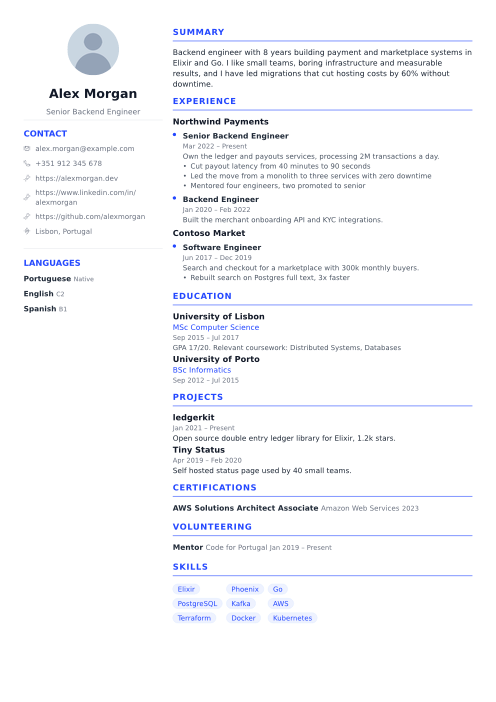
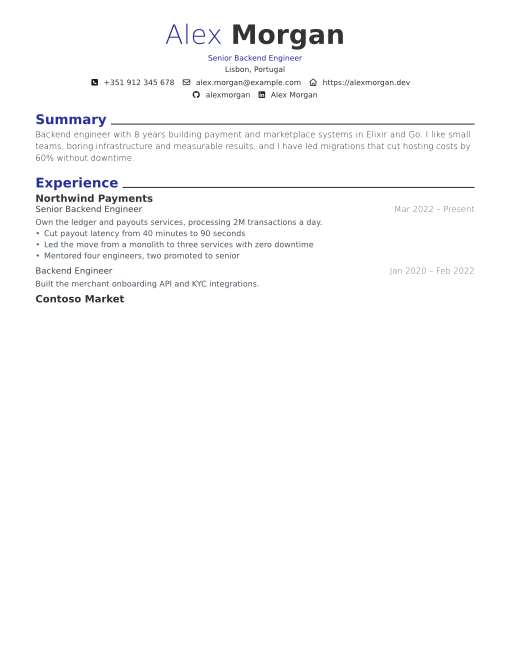

# IdealJob resume templates

The CV templates for [IdealJob](https://idealjob.app)'s resume builder, written
in [Typst](https://typst.app). Anyone can add one by pull request: once it's
merged, every IdealJob user can pick it in **Build Resume**.

| Classic Blue | Modern No Photo |
|---|---|
|  |  |

## How it works

```
templates/<id>/template.typ   how the CV looks
templates/<id>/meta.json      name, author, paper size, photo or not
lib/idealjob.typ              loads the candidate's CV and handles the edge cases
samples/*.json                the test CVs every template must handle
docs/data-contract.md         every field a template gets
scripts/check.sh              renders all templates × samples and checks the rules
```

A template never sees code, only data: IdealJob turns the candidate's CV into
JSON (see [the data contract](docs/data-contract.md)) and renders the
template with it, the same way `scripts/check.sh` does with the samples.

## Make a template

See [CONTRIBUTING.md](CONTRIBUTING.md). In short:

```bash
cp -r templates/classic-blue templates/my-template   # start from one
typst watch --root . templates/my-template/template.typ preview.pdf
scripts/check.sh my-template                         # before opening the PR
```

## Request a template

Not a designer? [Open a request](../../issues/new?template=request-template.yml)
with a description or a link to a CV you like.

## For maintainers

See [docs/maintainers.md](docs/maintainers.md) for reviewing pull requests
and releasing templates to IdealJob.

## Licence

[MIT](LICENSE). Templates are contributed under the same licence.
